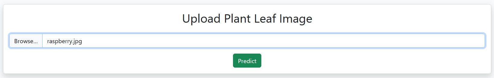
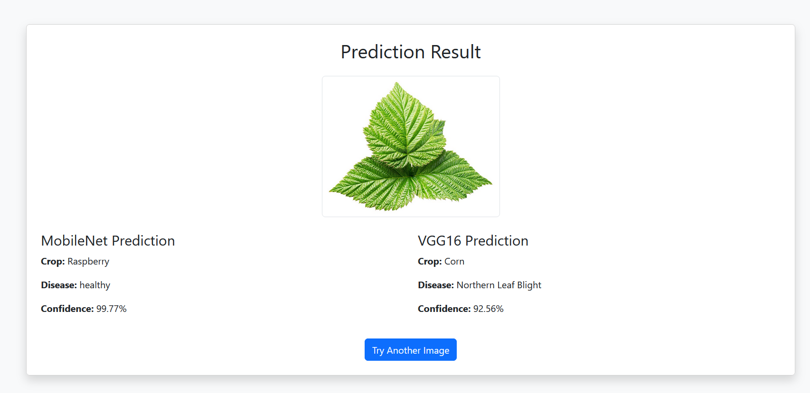
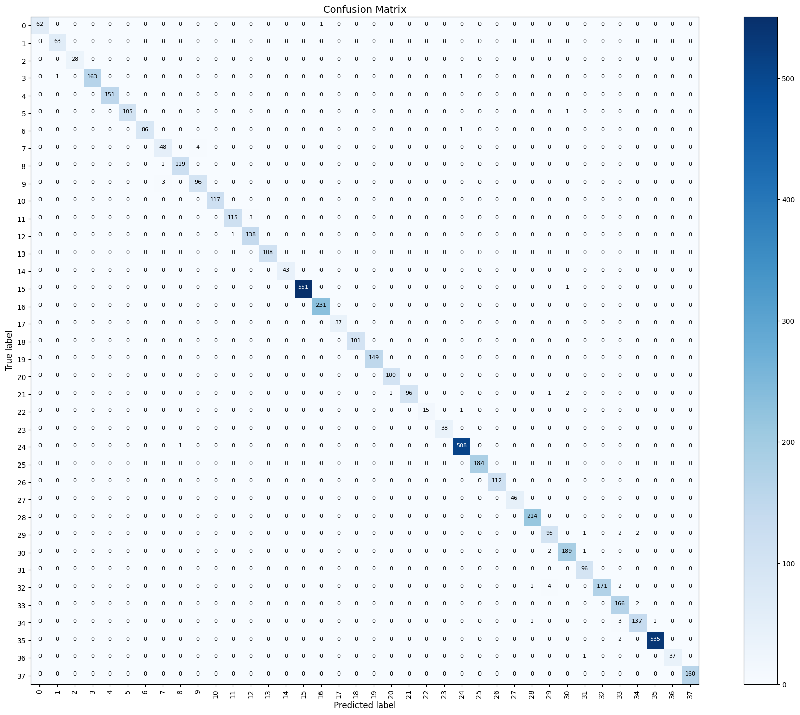
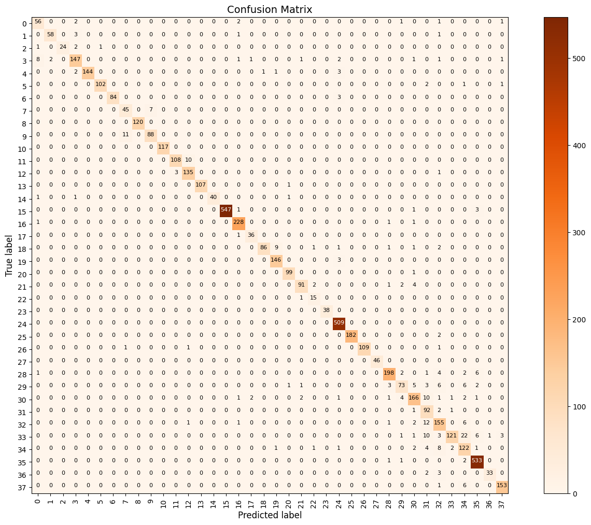

# 🪴 Crop Disease Detection Web App

A Flask web application that detects plant leaf diseases using two fine-tuned deep learning models: **MobileNet** and **VGG16**. Upload an image of a plant leaf, and the app will predict the **crop** and the **disease (if any)**, along with a **confidence score**.

---

## 🌟 Features

- Upload plant leaf images via browser
- Predicts crop type and disease name
- Uses fine-tuned **MobileNet** model (`.h5`)
- Also supports **VGG16** model for local deployment
- Easily deployable on **Render**

---

## 📸 Demo

### Home Page


### Result Page


---

## 🔗 Live Demo

👉 **[Click here to try the app](https://crop-disease-detection-vsr7.onrender.com)**

---

## 🧠 Model Info

- **Models Used**: MobileNet and VGG16 (fine-tuned on PlantVillage dataset)
- **Classes**: 38 crop-disease combinations
- **Input Size**: 224x224 RGB image
- **Framework**: TensorFlow + Keras
- **Dataset**: PlantVillage  
  🔗 [Download it here](https://www.kaggle.com/datasets/abdallahalidev/plantvillage-dataset)

---

## 📊 Model Accuracy

Visualize model performance using confusion matrices.

### MobileNet Confusion Matrix


### VGG16 Confusion Matrix


---

## 📁 Project Structure

```
crop-disease-detection/
├── app.py
├── templates/
│   ├── index.html
│   └── result.html
├── developing-models/
│   └── MobileNet.ipynb
├── static/
│   ├── uploads/
│   └── demo/
│       ├── home.png
│       ├── result.png
│       ├── cfmatrixMobileNet.png
│       └── cfmatrixVGG16.png
├── models/
│   └── MobileNet.h5
├── requirements.txt
└── README.md
```

---

## ⚙️ How to Run Locally

1. **Clone the repository**  
   ```bash
   git clone https://github.com/pic-road/crop_disease_detection.git
   cd crop-disease-detection
   pip install -r requirements.txt
   ```

2. **Train MobileNet model**  
   - Open `developing-models/MobileNet.ipynb` on **Google Colab** (recommended for GPU support)
   - Train and export the model as `MobileNet.h5`

3. **(Optional) Train VGG16 model**  
   - Write and run a similar notebook `VGG16.ipynb` to fine-tune and save the VGG16 model

4. **Run the Flask app locally**  
   ```bash
   python app.py
   ```
